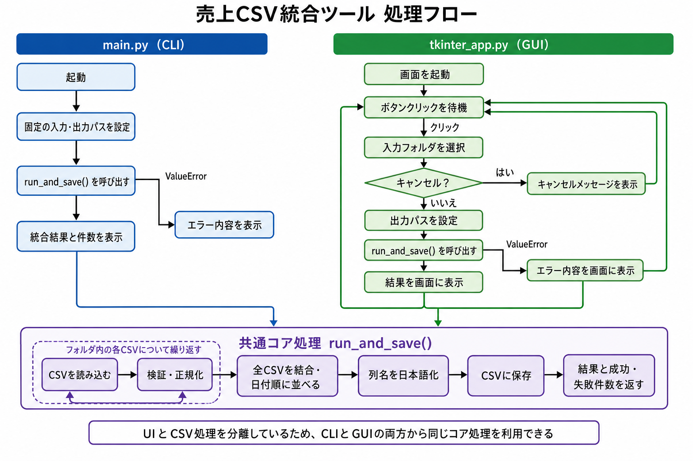
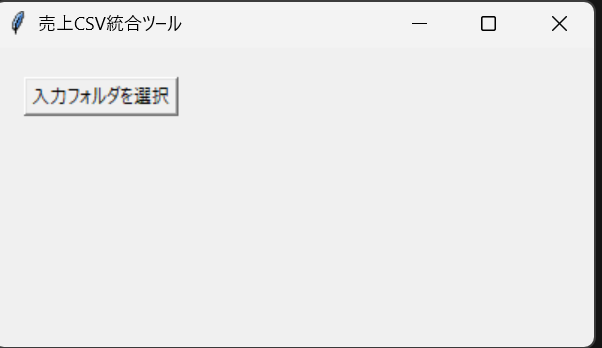
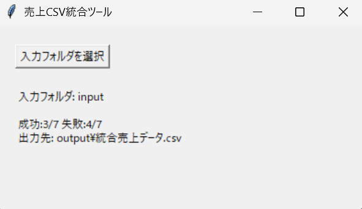

# 01_sales-csv-consolidator

複数支店から届く、列名・日付形式が統一されていない売上CSVを、共通フォーマットへ整形・統合する業務自動化ツール（架空案件想定）。

## 概要

- 課題: 支店ごとに列名・日付形式がバラバラなCSVを、担当者が毎月手作業で整形・結合している
- 入力: 支店別CSV（列名違い・日付形式違い・不要列・空欄・重複などを意図的に含む）
- 出力: 共通フォーマットに統合されたCSV（店舗名はファイル名から取得）
- UI: CLI / Tkinter GUI
- 構成: CSV処理コア（`src/core/`）とUI（`src/ui/`）を分離

## 使い方

```powershell
# 初回のみ: venv作成 + 依存インストール
python -m venv .venv
.\.venv\Scripts\Activate.ps1
pip install -r requirements.txt

# 2回目以降（新しいターミナルを開いた時）
.\.venv\Scripts\Activate.ps1

# 実行（GUI版）
python src/ui/tkinter_app.py

# 実行（CLI版）
python src/main.py
```

`samples/input/`内のCSVを読み込み、`samples/output/統合売上データ.csv`に統合結果を出力する。

## 処理フロー



## 画面

起動直後:



実行後（成功/失敗件数と出力先を表示）:



## Before / After

支店ごとに列名・日付形式・列構成がバラバラなCSVを、統合ツールが1つの共通フォーマットにまとめる。

**Before（支店ごとの入力CSV、列名・日付形式が不統一）**

`東京支店_2026年8月売上.csv`

| 売上日 | 商品名 | 単価 | 数量 |
|---|---|---|---|
| 2026/08/01 | オフィスチェア | 12800 | 2 |
| 2026/08/01 | ワイヤレスマウス | 2980 | 5 |

`大阪支店_2026年8月売上.csv`

| 日付 | 商品 | 価格 | 個数 |
|---|---|---|---|
| 2026-08-01 | オフィスチェア | 12800 | 1 |
| 2026-08-01 | ワイヤレスマウス | 2980 | 4 |

`福岡支店_2026年8月売上.csv`（「備考」列が余分にある）

| 販売日 | 品名 | 金額 | 販売数 | 備考 |
|---|---|---|---|---|
| 2026.08.01 | オフィスチェア | 12800 | 2 | 通常 |
| 2026.08.01 | ワイヤレスマウス | 2980 | 5 | 店頭販売 |

**After（統合後、`統合売上データ.csv`）**

| 売上日 | 商品名 | 単価 | 数量 | 店舗名 |
|---|---|---|---|---|
| 2026-08-01 | オフィスチェア | 12800 | 2 | 東京支店 |
| 2026-08-01 | ワイヤレスマウス | 2980 | 5 | 東京支店 |
| 2026-08-01 | オフィスチェア | 12800 | 1 | 大阪支店 |
| 2026-08-01 | ワイヤレスマウス | 2980 | 4 | 大阪支店 |
| 2026-08-01 | オフィスチェア | 12800 | 2 | 福岡支店 |
| 2026-08-01 | ワイヤレスマウス | 2980 | 5 | 福岡支店 |

列名・日付形式が統一され、不要列（備考）が削除され、店舗名が付与されている。
